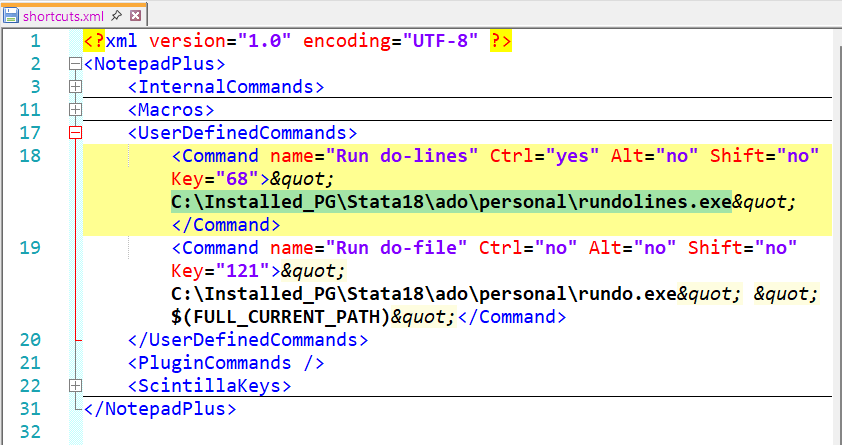
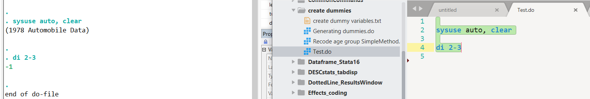

## Integrate Stata and R with Modern External Editors

Stata integration resources are often out of date and scattered. Here, I bring three `modern(ish)` editors for coding. This will help you run Stata code from `modern(ish)` external editors, such as Sublime Text 3, Notepad++, and Visual Studio Code.

*Updates in Nov 2023: Sublime Text 4 can run Stata code (tested in Windows PC). See the keymap, [SublimeText-KeyBindings](SublimeText-KeyBindings/Stata-ST3.sublime-keymap) for ST3 and ST4 under `SublimeText-KeyBindings` folder in the repository.

For Sublime-R integration, see a separate repository here (<https://github.com/sook-tusk/Tech_Creative_Workflow_Using_R_and_Sublime>).*

Download Sublime Text 3 (<https://www.sublimetext.com/3>), Notepad++(<https://notepad-plus-plus.org/downloads/>), and Visual Studio Code (<https://code.visualstudio.com/>). Both 32 bit and 64 bit version (in Windows PC) should work. Should you experience any compatibility issues while using earlier Stata versions (e.g., Stata 14), consider the *32 bit* version. For Notepad++ and Visual Studio Code, any latest version should be fine.

Once installed, play with them by yourself. Simple googling with get you started with basic functionality (opening a folder tree in the editor, using command palette) fairly quickly. There are many excellent resources online. When you are familiar with basic functionality, go ahead and follow the instructions here that walk you through integrating these fabulous tools with Stata.

## Why bother?

To enhance your workflow! One can manage multiple projects while obtaining training at the same time at one's own pace. You may assign one editor for the current project, while using *another* editor testing code in the *tutorial* folder. For instance, I usually run Stata from Sublime Text, while learning or testing new Stata code in VScode. In both cases, a whole folder or directory is accessible.

Another advantage is that external editors allow more features. I interpret this as the **facilitation of creative work**. The aesthetics and rich functionality can be a good motivator!

Finally, one needs changes from the *default* editor! The freedom to choose an editor depending on your mood and the needs will greatly improve your productivity!

Migrating to a new PC? All information you need is here.

## What do I offer?

## Stata

### Stata + Notepad++

There is a great guide linking Stata to Notepad++ by <https://huebler.blogspot.com/2008/04/stata.html>. It is great. The only thing that bothered me was the focus being left in Stata (cursor is on Stata window). As such, I tweaked his code to bring the focus back to the editor where code was sent from.

### Stata + Visual Studio Code

I essentially recycled the notepad++ integration procedure by configuring my tweaked rundolines programmes in the VSCode to run Stata code.

### Stata + Sublime Text 3

Sublime Text (<https://www.sublimetext.com/3>) is stunning and incredibly fast. You'll see Sublime Text just launches in a second. It's beautiful. It's a pure joy!

I have to admit that Sublime Text has *some* learning curve. First-time users may find Sublime Text overwhelming due to its technical aspects to learn. I think this is totally worth it. Allow yourself to learn at your own pace and learn a keyboard shortcut one at a time. Once you get the hang of using menu options and their corresponding shortcuts, code-writing becomes very fast. Sublime Text has become an indispensable tool for me over years (especially during Covid!) and I highly recommend using it.

For integration, there is an excellent resource: <https://packagecontrol.io/packages/StataEditor>.

I have a light theme dedicated to run Stata code in Sublime Text 3. My customised light-theme is available in the repository.

# INSTRUCTIONS BEGINE HERE

Click on the green button, Code, and select Download ZIP. Unzip it and follow the instructions below.

In terms of complexity and effort for integration, Visual Studio Code may be the easiest. I assume Stata is already installed in your PC.

General principles are similar across platforms. The procedures for Mac users are also shown. See [for Mac users](#macusers)

# In Windows :
# Integration 1: Stata 16 + Notepad++

## Step 1: Install Notepad++

Notepad++ is freely available but only in Windows PC. It is not modern but it is robust. Sometimes, I just quickly edit files here, rather than running the code.

## Step 2: Save "rundolines"

Locate the "rundolines" folder under `Stata_notepad++_setup` folder. The "rundolines" folder contains rundolines programmes and the user-settings file, `rundolines.ini`. These were originally developed by Friedrich Huebler and I tweaked so that the focus is back to the editor.

Two files will be placed under: `C:/yourfolder/Stata16/ado/personal/`

Please create **ado** and **personal** folders as necessary. 

Open the *ini* file and customise the Stata version and path.

I usually create a backup .ini file by renaming it as `rundolines_raw.ini` for future reference, while keeping the current customised version of .ini file.

## Step 3: Set Notepad++ to run Stata code

The next step is set Notepad++ to add Stata in the programming language list and set a shortcut to run the Stata code. Under the `Stata_notepad++_setup` folder, you'll see the folder, `userDefineLangs`, and other xml files including shortcuts. Select all of these and place them here:

> C:\\Users\\username\\AppData\\Roaming\\Notepad++\\

To get the shortcut to work correctly, you also need to ensure the `rundolines.exe` path. Open `shortcuts.xml` and customise the rundolines.exe path as needed. 

Apart from setting the rundolines.exe path, there is *no need to customise shortcuts*. You'll see I've set Ctrl+D to run Stta code and Ctrl + L to select the current line shortcut in Notepad++. Other shortcuts were also modified to match with Sublime Text's shortcuts. Here's the summary:

> *Ctrl + D* : Run Stata code

> *Ctrl + L* : Select current line

> *Alt + D* : Duplicate line

> *Ctrl + Shift + K* : Delete current line

> *Ctrl + Alt + Up/Down* : Multiple cursors

You can change the shortcuts in Notepad++'s **Run** menu. This should help with your workflow, but if you need additional help, visit Friedrich Huebler's blog: <https://huebler.blogspot.com/2008/04/stata.html>.

## Step 4: All done. Test it.

Open any `do` file and test running some Stata code by pressing Ctrl+D.

# Integration 2: Stata 16 + Visual Studio Code

## Step 1: Install VSCode

VSCode (Download here <https://code.visualstudio.com/>) is open source and freely available across platform (Windows, Mac and Linux). It is modern, compared to notepad++, and boasts aesthetically-pleasing interface. VSCode is evolving very fast thanks to many contributors and in constant development. This means ongoing support is available from many fellow users and developers. You can open an entire project and open files side by side. Please note that VSCode could take up a significant amount of RAM space when a folder tree is complex and the number of file is large. You can learn to display images without leaving the editor. So, why not reap the benefit by running Stata code here?

## Step 2: Save "rundolines"

If you have done so already, skip this step. If you haven't, see Integration 1: Stata 16 + Notepad++ above.

## Step 3: Set VSCode to run Stata code

### A. Install "Stata Enhanced" to highlight Stata syntax.

First of all, VSCode should recognise the Stata programming language and highlight the syntax with pre-defined colours. In VSCode, the user-contributed extension, *Stata Enhanced*, does this job.

On the left-hand side of VSCode menu, you'll see an icon for Extensions. Search for *Stata Enhanced* and click `install`. Done.

### B. To run the code, we need "Code Runner".

*Stata Enhanced* highlights syntax, but running the code is a separate step. For this, we need to install the extension called *Code Runner*. Click on Extension icon and search for *Code Runner* and click `install`.

### C. Change USER settings for "Code Runner".

As *Code Runner* can run many programming languages, we need to ensure Stata is included in the settings. To do so, we need to open VSCode settings json file. Press F1. This triggers an empty window. This is called Command Palette. The cursor is waiting for a command. Start typing "Open User Settings (JSON)", and press enter. In settings.json file, along with other VSCode settings, include code-runner configuration as below.

```py         
      {
        "workbench.colorTheme": "One Dark Pro",
        "code-runner.executorMap": {
            "stata": "C:\\Installed_PG\\Stata16\\ado\\personal\\rundolines.exe",

        },
        "code-runner.executorMapByFileExtension": {
            ".do": "stata",
        },
        "code-runner.saveFileBeforeRun": true,
        "code-runner.showExecutionMessage": false,
      }
```

As I am not planning on using other programming languages, I simplified the configuration as above.

### D. Set a shortcut key, ctrl+d.
Set as `ctrl+d` to run Stata code (consistent with Sublime).

In VSCode, press `F1 (or fn+F1 in laptops) > type Preferences: Open Keyboard Shortcuts (JSON)` to open the shortcut keys json file. Copy and paste the following at the end of the json file inside the square brackets, `[]`.
```py 
[

  // ========= STATA =======
  {
    "key": "ctrl+d",
    "command": "code-runner.run",
    "when": "editorTextFocus && !editorReadonly && editorLangId == 'stata'"
  },

]  
```
You may change the keyboard shortcut as you wish. Press F1 \> Open Keyboard Shortcuts \> type Run code. Change the shortcut as desired.

## Step 4: All done. Test it.

Open any `do` file and type `display 2-3` three times in separate lines. Highlight the line of code and press `Ctrl+d` (No need to highlight if you run a single line of code).

## Known issues

Stata windows opens up fine, but in VSCode, another Output panel pops up. As we cannot disable this, the best way we can get around the problem is to place that Output panel to the bottom or right of VSCode.


# Integration 3: Stata + Sublime Text 3

## Step 1: Install Sublime Text 3

Download Sublime Text 3 (<https://www.sublimetext.com/3>). It is not completely free but there are ways to get around. There is no fixed time period until purchase so take your time. Supporting the developers is a great idea, too. Sublime Text 4 is available but I stick with Sublime Text 3, as other languages are all set here to run as well.

## Step 2: Install "Stata Editor" package in Sublime Text 3

Check the excellent resource: <https://packagecontrol.io/packages/StataEditor> to install "Stata Editor" package in Sublime Text 3.

As we did earlier with rundolines.ini file, we ensure Sublime Text recognises your Stata version and path. In Sublime Text menu, go to `Preferences > Package Settings > Stata Editor > Settings - User` to open the user customisation file. Copy below or edit as necessary.

```py         
{
    "ensure_newline_at_eof_on_save": true,

    "stata_path": "C:/Program Files (x86)/Stata14/StataMP-64.exe",
    "stata_version": 14,

    // "stata_path": "C:/Installed_PG/StataIC-64.exe",
    // "stata_version": 16,

    "file_completions": false,
    "function_completions": true,
    "variable_completions": true,
    "waiting_time": 0.7,
    "character_encoding": "windows-1252",
    "command_completions": true,
    "default_path": "project_path",
    "extensions":
    [
        "do",
        "txt"
    ],
    // "color_scheme": "Packages/User/Color Highlighter/themes/SK_Stata_markdown.tmTheme"
}
```

There are quite a lot of lines, but the most important thing is the path and the version of Stata. I jump between Stata versions so I disabled Stata 16 and activated Stata 14. The last line concerns colour scheme. See *Optional* stage for more detail. I disabled it for now.

## Step 3: Set shortcuts, ctrl+d
Access key bindings file by pressing **Ctrl+Shit+P > type Preferences: Key Bindings > Enter**.

To customise your user key bindings file, refer to the example keymap file (In the repository, see [SublimeText-KeyBindings](SublimeText-KeyBindings/Stata-ST3.sublime-keymap) for ST3 located under *SublimeText-KeyBindings* folder. 

## Step 4: Register in the Stata Automation type library

The final step involving Stata Automation type library <https://www.stata.com/automation/#createmsapp> can be tricky. In essence, we request permission from Stata to run the code externally. I had a colleague stuck at this stage, so some screenshots are included. Here are the detailed steps:

1.  Go to where Stata.exe file is. It's usually here: `C:\Program Files (x86)\Stata14`. Right-click on the `StataMP-64.exe`, then from the drop-down menu, choose **Create shortcut** (If your computer tells you it'll be created on desktop, click on yes, and move the icon to the Stata.exe directory manually). The newly created icon is called `StataMP-64.exe - Shortcut`.

2.  Right-click on `StataMP-64.exe - Shortcut`, choose **Properties**, and notice the **Target** is set as "C:\\Program Files (x86)\\Stata14\\StataMP-64.exe". We'll add `/Register` at the end as below, and click on OK.

    > "C:\\Program Files (x86)\\Stata14\\StataMP-64.exe" /Register

    

3.  Right-click on the `StataMP-64.exe - Shortcut` again then choose **"Run as administrator"**. This completes registration. Well-done.

## Step 5: All done. Test it.

Open any `do` file and test running some Stata code. Highlight the block of code and press `Ctrl+D`. It is liberating in the sense that there is no need to highlight the current line of code if you run a single line, as in Visual Studio Code. It is very handy when you are testing the code line by line, rather than a block of code. You should expect something like this. Here, you can see Stata output, the full folder tree, and the code side by side.



## Optional: Set Colour Scheme

See the sub-folder of the repository to see the Colour Scheme file and follow the instructions.


# for Mac users <a href="macusers" id="macusers"/>
# Integration 1: Stata + Sublime Text 4
Download Sublime Text 4 by visiting here: https://www.sublimetext.com/

In Mac, instead of Stata Editor, we need to install `Stata Improved Editor` package. One may install `Stata Enhanced` but I have not tried this package. See the detailed information here: https://packagecontrol.io/search/stata 

Set the shortcut by accessing the key bindings file.
```py
// ===== Mac, Stata - ST4  =====
  {
    "keys": ["ctrl+d"], "command": "lines_to_stata"
  },
```
It should work without changing any other settings in Sublime in Mac.
Run as you'd normally do by pressing `Ctrl+d` to run Stata code. This triggers to launch Stata, and the output will be printed in Stata window. 

# Integration 2: Stata + Visual Studio Code

## Step 1: Install VSCode extension
  - Install `Stata Enhanced` by Kyle Barron.

This extension allows Stata code highlights. 

To run Stata code, we need `stataRun`.
- Install `stataRun` by Yeaoh Media Inc.

You can access Extensions on the left-hand side of VSCode. Locate Extensions among major menu icons. 

## Step 2: Configure VSCode
Press `fn+F1` (or F1). This triggers an empty window, called Command Palette. The cursor is waiting for a command. Start typing "Open User Settings (JSON)", and press enter to luanch your settings.json file.

In settings.json file, add the following:
Customise as necessary. Yours may be "stataMP".
```json
// ============= Stata ==================
  "stataRun.whichApp": "stataIC",
```

## Step 3: Complete. Test running Stata code now
Restart VSCode.
Then, open a do file to run. Highlight a line of code. 
To run the code, press `Cmd+Shift+S`.
Customise the shortcut as necessary (to be updated).
See other default shortcuts here: https://github.com/poidstotal/stataRun

## Troubleshoot 
- If a new instance of Stata window is not triggered, try restarting VSCode several times at each stage.

## Issues
- The cursor is left in Stata window, not back in VSCode. Can look in future. 


# Stata Tips
## Using multiple versions of Stata

You can do so! As I have two versions of Stata, I set Sublime Text 3 to run Stata 14, while Visual Studio Code interacting with Stata 16 (by editing ini file accordingly). The benefit is huge as Stata 14 lacks many options (e.g., current line highlighting, gutter-colour options, etc). Sublime Text will take care of all these.

If you are using multiple versions, it's best to place `rundolines.exe` along with Stata exe file as `C:yourpath\Stata16\rundolines.exe`. After recent Windows Updates, I needed to change as above to get VSCode to run Stata code accordingly.

## System directory

In Stata, type `sysdir`. Your default PERSONAL System directory may be:

```py         
 PERSONAL:  c:\ado\personal\
```

I use above for Stata14. For Stata16, I use a different directory by customising as below (to avoid conflicts and issues arising from different versions of Stata. This was the case after a recent series of Windows PC updates). To make the change permanently, define the customised path in the `profile.do`.

```py         
 PERSONAL:  C:Installed_PG\Stata16\ado\personal\
```

The `profile.do` can be placed under `C:Installed_PG\Stata16`. You'll see whenever Stata 16 is launched, Stata will look for profile.do and run the code in the profile.do.

# Enable preview for a Stata Do file in Windows File Explorer
This feature can be very handy for a quick browse in the File Explorer. Essentially, we set Windows to recognise *.do* file as a *.txt* file, instead.

1. In the search bar (located at the bottom left of Windows PC),
type *Reg* to launch Registry Editor.

2. Look for the extension, .do

   You'll see file extensions under:
> Computer\HKEY_CLASSES_ROOT\.do

3. On the right-hand pane, do the following:
   right-click > New > String value


4. From the default, *New Value #1*,
   rename as **PerceivedType**.


5. Now, click on **PerceivedType** to
bring up Modify... menu.


In the Value data: type *text*.


6. Finally, return to the file explorer and
hover over a do file. The preview pane should display the Stata code.


If this feature stops working after Windows updates, you may need to repeat this process.

Note that syntax highlighting is not supported, and it works with a *personal* Windows PC. Hopefully, .do extension is included in the Windows PC by default one day. Still, for now, it's a significant improvement!

# Reference

Huebler (2011). Friedrich Huebler's blog <https://huebler.blogspot.com/2008/04/stata.html>

Thank you for reading. I hope it helps with your Stata workflow, and ongoing project management! 

