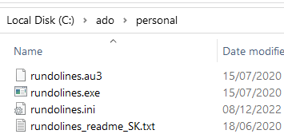

# Step 1: Install VSCode and Stata

VSCode is open source and freely available across platform (Windows, Mac and Linux). It is modern, compared to notepad++, and boasts aesthetically-pleasing interface. When I first tried years ago, I felt VSCode was lagging. However, VSCode is evolving very fast thanks to many contributors and in constant development. This means ongoing support is available from many fellow users and developers. You can open files side by side and (with more experience) you can learn to display images right in the editor. So, why not reap the benefit by running Stata code here?

# Step 2: Save "rundolines"

Unzip the rundolines.7z folder. (To unzip, you need 7-zip. Download 7-zip free here <https://www.7-zip.org/>). The folder contains rundolines programmes (As Huebler advises, *rundo* programme is not needed) . These were originally developed by Friedrich Huebler and I tweaked so that the focus is back to the editor.

All files will be placed under: `C:/ado/personal/`

To do so, in C drive, create **ado** and **personal** folders. 

Then, put the unzipped files as shown above. Check your Stata version and path. These settings are defined in the *rundolines.ini* file. Open this *ini* file and customise the settings according to your system settings. See Friedrich Huebler's blog <https://huebler.blogspot.com/2008/04/stata.html> for more details.

# Step 3: Set VSCode to run Stata code

## A. Install "Stata Enhanced" to highlight Stata syntax.

First of all, VSCode should recognise the Stata programming language and highlight the syntax with pre-defined colours. In VSCode, the user-contributed extension, *Stata Enhanced*, does this job.

On the left-hand side, you'll see an icon for Extensions. Search for *Stata Enhanced* and click `install`. Done.

## B. To run the code, we need "Code Runner".

*Stata Enhanced* highlights syntax, but running the code is a separate step. For this, we need to install the extension called *Code Runner*. Click on Extension icon and search for *Code Runner* and click `install`.

## C. Change settings for "Code Runner".

As *Code Runner* can run many programming languages, we need to ensure Stata is included in the settings. To do so, we need to open VSCode settings json file. Press F1. This triggers an empty window. This is called Command Palette. The cursor is waiting for a command. Start typing "Open User Settings (JSON)", and press enter. In settings.json file, along with other VSCode settings, include code-runner configuration as below.

          {
            "workbench.colorTheme": "One Dark Pro",
            "code-runner.executorMap": {
                "stata": "C:\\ado\\personal\\rundolines.exe",
                "autoit": "autoit3",
                "javascript": "node",
            },
            "code-runner.executorMapByFileExtension": {
                ".do": "stata",
            },
            "code-runner.executorMapByGlob": {
                "pom.xml": "cd $dir && mvn clean package"
            },
            "code-runner.saveFileBeforeRun": true,
            "code-runner.showExecutionMessage": false,
          }  

As I am not planning on using other programming languages, I simplified the configuration as above.

# Step 4: All done. Test it.

Open any `do` file and type `display 2-3` three times in separate lines. Highlight the line of code and press `Ctrl+Alt+A` (No need to highlight if you run a single line of code). Alternatively, you can right click to bring the menu, `Run Code`. You may change the keyboard shortcut as you wish later.

# Known issues

Stata windows opens up fine, but in VSCode, another Output pops up. As we cannot disable this, the best way we can get around the problem is to place that Output panel to the bottom of VSCode.

# Reference

Friedrich Huebler's blog <https://huebler.blogspot.com/2008/04/stata.html>
